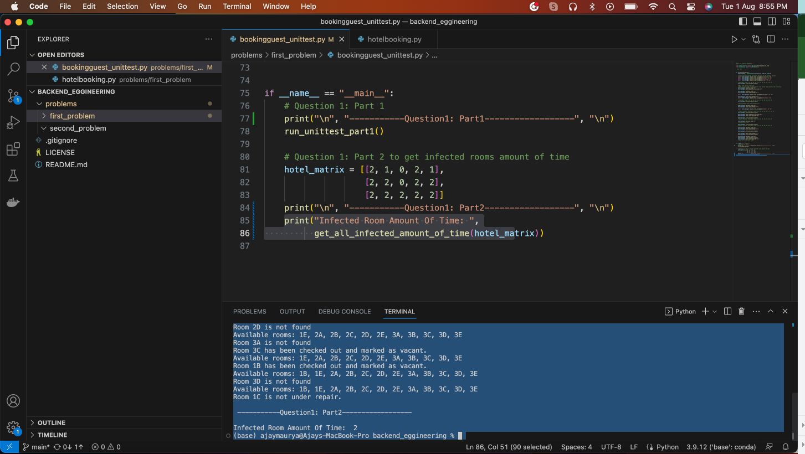

# backend_eggineering
Software Design and Implementation

# First we need to define constant enum value for all possible state. 

# Create the floor and room "ADBCDE"
Created class HotelRoomBooking to home the hotel room available default dictionary. with respect to the each each given floors 

# You can choose any method for input/output but must have:
• A method to request room assignment, which will reply with the assigned room number upon
success.
• A method to check out of a room (Vacant).
• A method to mark a room cleaned (Available).
• A method to mark a room for out of service (Repair).
• A method to mark a room as repaired (Vacant).
• A method to list all the available rooms.

# To fulfill the requirements, I'll provide a Python program with the following classes and methods:
## HotelRoomBooking: 
A class representing the hotel room manager that handles room assignments, checkouts, and room status changes.
## Room:
A class representing each individual room with its status.
## RoomStatus: 
An enumeration to represent the possible room statuses.
Unit tests for the provided functionality.

# How to execute this program:
1.	Clone project from GitHub repository [git@github.com:ajay9889/backend_eggineering.git] 
2.	Make sure you have Python installed on local system 
3.	Run the below command. 
4.	> python bookingguest_unittest.py

Please read details document for more information.

